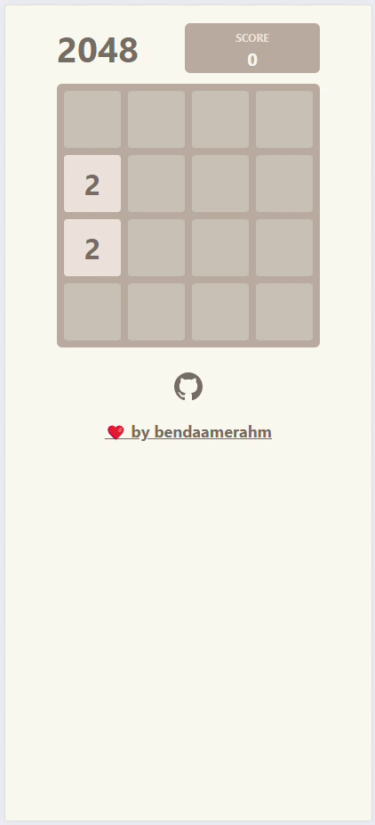

# SwipeSum-in-react

## [💥 Play SwipeSum 💥](https://github.com/bendaamerahm/SwipeSum/)

## Features

- Fully-functional SwipeSum GAME
- Animations
- Supports **keyboard**, **mouse** and **touch** events

## Development

_Easily set up a local development environment!_

Just start dev server on [localhost](http://localhost:3000):

- clone
- `npm install`
- `npm run dev`

**Start coding!** 🎉

## Contributing

All contributions are welcome!

## Author

- Ahmed Ben Daamer ([@bendaamerahmed](https://www.ahmedbendaamer.fr))
